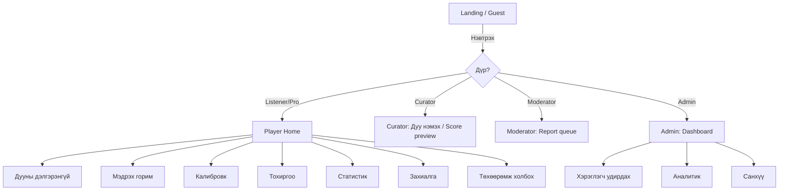
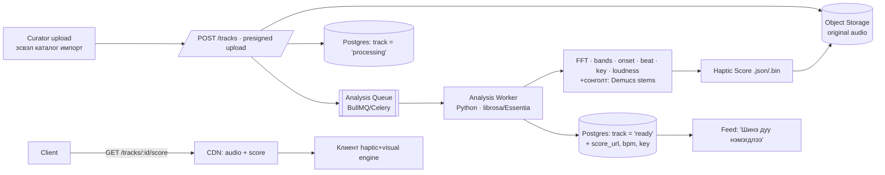
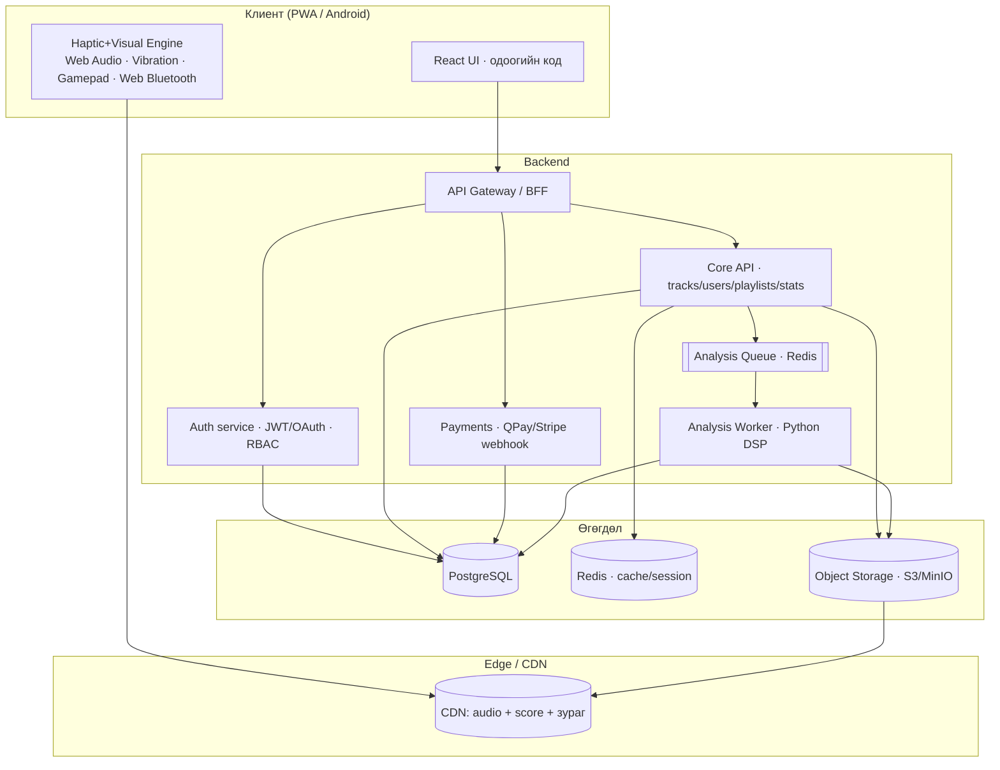

# МЭДРЭХ® — Production Fullstack дизайн баримт бичиг

> **Сонсголын бэрхшээлтэй хүмүүст зориулсан хөгжмийн платформ.**
> Дуу авиаг **чичиргээ (haptic) + гэрэл/визуал + хөдөлгөөн** болгон хувиргаж, дүлий/сонсголгүй хүнд хөгжмийг *мэдрүүлдэг* систем.
>
> Энэ баримт бичиг нь одоо байгаа frontend прототип (`medreh-react`)-ийг **бодит production fullstack** бүтээгдэхүүн болгож хувиргах бүрэн төлөвлөгөө юм.
> Агуулга: дүрүүд · дүр бүрийн UI · дуу/дата хаанаас яаж орж ирэх · дуу→мэдрэхүй хувиргалтын шинжлэх ухаан ба техник · архитектур · DB · API · төхөөрөмж · аюулгүй байдал · roadmap · дипломын хамгаалалт.

**Хувилбар:** v1.0 · **Огноо:** 2026-07-24 · **Төлөв:** Диплом (production болгох төлөвлөгөө)

---

## Агуулга

1. [Одоогийн байдал ба зорилго (gap analysis)](#1-одоогийн-байдал-ба-зорилго)
2. [Шинжлэх ухааны үндэс — сонсголгүй хүн хөгжмийг хэрхэн мэдэрдэг вэ?](#2-шинжлэх-ухааны-үндэс)
3. [Гол хөдөлгүүр — дуу → мэдрэхүй хувиргалт](#3-гол-хөдөлгүүр--дуу--мэдрэхүй-хувиргалт)
4. [Хэрэглэгчийн дүрүүд (Roles)](#4-хэрэглэгчийн-дүрүүд-roles)
5. [Дүр бүрийн UI (дэлгэцүүд)](#5-дүр-бүрийн-ui-дэлгэцүүд)
6. [Дата/дуу — хаанаас, яаж орж ирэх вэ](#6-датадуу--хаанаас-яаж-орж-ирэх-вэ)
7. [Дуу боловсруулах pipeline (backend DSP)](#7-дуу-боловсруулах-pipeline)
8. [Системийн архитектур](#8-системийн-архитектур)
9. [Технологийн стек](#9-технологийн-стек)
10. [Өгөгдлийн загвар (DB schema)](#10-өгөгдлийн-загвар-db-schema)
11. [API дизайн](#11-api-дизайн)
12. [Төхөөрөмжийн интеграци (haptic devices)](#12-төхөөрөмжийн-интеграци)
13. [Хүртээмж — Deaf-first дизайн](#13-хүртээмж--deaf-first-дизайн)
14. [Аюулгүй байдал, нууцлал, эрх зүй](#14-аюулгүй-байдал-нууцлал-эрх-зүй)
15. [Хөгжүүлэлтийн замын зураг (Roadmap)](#15-хөгжүүлэлтийн-замын-зураг)
16. [Туршилтын стратеги](#16-туршилтын-стратеги)
17. [Deploy / DevOps](#17-deploy--devops)
18. [Дипломын хамгаалалтад зориулсан хэсэг](#18-дипломын-хамгаалалтад-зориулсан-хэсэг)
19. [Хавсралт: одоогийн код → production зураглал](#19-хавсралт-одоогийн-код--production-зураглал)

---

## 1. Одоогийн байдал ба зорилго

### 1.1 Одоо юу байгаа вэ (прототип)

Танай `medreh-react` бол **аль хэдийн ажилладаг, гоё UX-тэй frontend прототип**. Гол чадварууд:

| Бүрэлдэхүүн | Одоогийн хэрэгжилт | Файл |
|---|---|---|
| UI framework | React 18 + Vite | `src/App.jsx`, `main.jsx` |
| Визуал хөдөлгүүр | Canvas 2D + Three.js (WebGL contour terrain, procedural photo) | `src/engine.js` |
| Аудио шинжилгээ | Web Audio API → `AnalyserNode` (FFT 256) → 3 бүс (lo/mi/hi) | `Player.jsx:182-244` |
| Чичиргээ | `navigator.vibrate()`, түвшингээс хамааран 170 мс тутам | `Player.jsx:246-258` |
| Калибровк | 4 алхамт мэдрэхүйн тест (чичиргээ/гэрэл/бүс) | `Calibrate.jsx` |
| Auth | localStorage + `btoa` обфускаци (**жинхэнэ hash биш**) | `AuthModal.jsx` |
| Дүр | `user` / `admin` | `App.jsx:29` |
| Дууны сан | 6 демо дуу (SoundHelix) + админы upload (IndexedDB) | `tracks.js`, `AdminPanel.jsx` |
| Захиалга | Mock PRO (9'900₮), 30 сек preview | `Player.jsx:453-513` |
| Статистик/Feed | localStorage-д per-user | `library.js` |

### 1.2 Production болоход юу дутуу вэ (Gap analysis)

> Прототип "нэг төхөөрөмж дээр, backend-гүй" ажилладаг. Production бол "хаанаас ч, олон хэрэглэгч, найдвартай, аюулгүй" ажиллах ёстой.

| Талбар | Прототип (одоо) | Production (зорилго) |
|---|---|---|
| **Backend** | Байхгүй | REST/GraphQL API + өгөгдлийн сан + object storage |
| **Auth** | `btoa`, localStorage | JWT + refresh, серверт `argon2/bcrypt` hash, OAuth, RBAC |
| **Дата хадгалалт** | localStorage/IndexedDB (1 төхөөрөмж) | PostgreSQL + S3 (олон төхөөрөмж sync) |
| **Дуу шинжилгээ** | Зөвхөн real-time (тухайн агшинд) | Урьдчилан тооцсон **Haptic Score** (backend DSP) |
| **Мэдрэхүйн нарийвчлал** | 3 бүс | 8–16 бүс + onset/beat + (сонголтоор) stem-based |
| **Төхөөрөмж** | Зөвхөн утасны vibrate | Утас + gamepad + BLE haptic vest + wearable |
| **Төлбөр** | Mock | Жинхэнэ (QPay/Stripe), webhook, нэхэмжлэх |
| **Дүр** | 2 | 5–7 (доор) |
| **Хууль/зохиогчийн эрх** | Демо дуу | Лицензтэй каталог + гэрээ |
| **Хүртээмж** | Сайн эхлэл | WCAG 2.2 AA + дохионы хэл (MSL) |

**Дипломын гол шинэлэг тал (novelty):** энгийн "audio → vibrate" биш, харин **давтамжийг биеийн байрлалд буулгасан (tonotopic) олон-сувагт хаптик + урьдчилан choreograph хийсэн Haptic Score + хувь хүний мэдрэхүйн калибровк** — энэ гурвыг веб дээр нэгтгэсэн Монгол хэл дээрх систем.

---

## 2. Шинжлэх ухааны үндэс

> "Сонсголгүй хүн хөгжмийг чихээрээ биш — арьс, яс, нүдээрээ мэдэрнэ." (Evelyn Glennie, дүлий цохиврын виртуоз)

Энэ хэсэг нь дипломын онолын үндэслэл. Мэдрүүлэх аргачлал бүр эндээс гарна.

### 2.1 Арьсаар дуу мэдрэх (vibrotactile perception)

- Хүний арьс дэх **Pacinian corpuscle** мэдрэхүйн эсүүд ~**20–1000 Hz** чичиргээг мэдэрдэг ба **200–300 Hz орчимд хамгийн мэдрэмтгий**.
- Хөгжмийн бүрэн спектр (**20 Hz – 20 000 Hz**) арьсаар шууд дамжихгүй. Тиймээс өндөр давтамжийг **шууд өгч болохгүй** — доош буулгах (down-mapping) шаардлагатай.
- **Гол заль (production техник):** өндөр давтамжийн *агшин зуурын эрчмийг* (envelope) авч, **тогтмол 200–250 Hz "carrier" чичиргээг тэр эрчмээр модуляц** хийнэ. Ингэснээр "өндөр ноот" гэдгийг *хэмнэл/эрчмээр* дамжуулна (arm нь давтамжийг заримдаа "байрлалаар" ялгана — доор үзнэ үү).

### 2.2 Гурван мэдрэхүйн суваг

Танай прототип аль хэдийн 3 сувгийг зөв тодорхойлсон (`hmeta`: "Чичиргээ · Гэрэл · Хөдөлгөөн"):

| Суваг | Юуг дамжуулдаг | Хэрэгсэл |
|---|---|---|
| **Чичиргээ (haptic)** | Хэмнэл, бас, цохилт, эрчим | Утас, gamepad, haptic хантааз, wristband, bone conduction |
| **Гэрэл/Визуал** | Давтамж→өнгө, эрчим→гэрэлтэлт, цохилт→лугшилт | Дэлгэц, LED, орчны гэрэл |
| **Хөдөлгөөн** | Долгион, spectrum, орон зайн урсгал | 3D terrain, particle, waveform |

### 2.3 Хамгийн чухал зарчим: ХЭМНЭЛ хамгийн сайн дамждаг

Судалгаагаар сонсголгүй хүмүүст **хэмнэл (rhythm) ба темп** нь аяз/harmony-аас хамаагүй сайн дамждаг. Тиймээс:

1. **Beat/onset detection** нь системийн зүрх (доор). Цохилт болгонд тод, хүчтэй импульс.
2. **Бас (bass)** нь бие даан хамгийн их мэдрэгддэг тул тусдаа хүчтэй суваг.
3. Аяз (melody)-ыг **визуал + байрлалаар** нөхнө.

### 2.4 Давтамж → биеийн байрлал (tonotopy)

Чихний дун (cochlea) давтамжийг байрлалаар кодлодог шиг, **олон моторт хаптик хантааз** дээр давтамжийн бүсийг биеийн өөр өөр цэгт буулгаж болно:

```
Өндөр (4–20 kHz) ─▶ мөр / хүзүү орчим (жижиг, түргэн buzz)
Дунд  (250–4k)   ─▶ хавирга / цээж хажуу
Бас   (20–250)   ─▶ доод цээж / гэдэс (том мотор, урт хүчтэй)
```

Энэ бол дипломын хүчтэй онолын өгүүлэмж: *"surface cochlea" / vibrotactile tonotopy.*

---

## 3. Гол хөдөлгүүр — дуу → мэдрэхүй хувиргалт

Энэ бол системийн **гол ялгаатай тал**. Production дээр 2 горим:

- **A. Real-time горим** — микрофон эсвэл шууд урсгал (одоогийн прототипийн арга). Хоцролт бага, гэхдээ "тэнэг" (ирээдүйг мэдэхгүй).
- **B. Precomputed Haptic Score горим** — backend дээр дууг урьдчилан задалж, цаг хугацааны индекстэй "хаптик ноот" үүсгэнэ. Илүү нарийн, choreograph хийсэн, батарей хэмнэдэг. **Production-ий гол.**

### 3.1 Haptic Score — гол өгөгдлийн бүтэц

Дуу бүрд backend нэг удаа задлаад дараах JSON-ыг үүсгэж хадгална (`.medreh.json` эсвэл нягтруулсан binary):

```jsonc
{
  "trackId": "trk_8f2a",
  "version": 2,
  "duration": 214.6,          // секунд
  "sampleRate": 60,           // фрейм/сек (60 Hz = 16.6 мс алхам)
  "bpm": 122,
  "musicalKey": "A minor",
  "bands": ["sub","bass","lowmid","mid","highmid","presence","brilliance","air"], // 8 бүс
  "frames": [                 // duration * sampleRate ширхэг
    // [ 8 бүсийн эрчим 0..1 ..., onset(0/1), beat(0/1), rms ]
    [0.9,0.7,0.3,0.1,0.0,0.0,0.0,0.0, 1, 1, 0.82],
    [0.4,0.5,0.2,0.1,0.0,0.0,0.0,0.0, 0, 0, 0.51]
    /* ... */
  ],
  "sections": [               // сонголтоор: бүтэц (intro/verse/chorus/drop)
    { "t": 0.0,  "label": "intro" },
    { "t": 32.4, "label": "drop", "energy": 0.95 }
  ],
  "stems": {                  // сонголтоор: source separation-аас
    "drums":  "trk_8f2a.drums.medreh.bin",
    "bass":   "trk_8f2a.bass.medreh.bin",
    "vocals": "trk_8f2a.vocals.medreh.bin"
  }
}
```

**Яагаад frame-based:** клиент зөвхөн `audio.currentTime * sampleRate`-аар индекслээд тухайн фреймийн утгыг моторуудад дамжуулна — маш хөнгөн, дискрет, синк баталгаатай.

### 3.2 Клиент дэх хаптик scheduler (production санаа)

Одоогийн `Player.jsx`-ийн 170 мс interval + босго (threshold) аргыг **Haptic Score-оор солино**:

```js
// Player доторх scheduler — precomputed score + device router
function haptcTick() {
  const t = audioEl.currentTime;
  const i = Math.floor(t * score.sampleRate);
  const f = score.frames[i];
  if (!f) return;

  const [sub,bass,lowmid,mid,highmid,presence,brill,air, onset, beat, rms] = f;

  // 1) Хэрэглэгчийн профайл (калибровкоос) — идэвхтэй бүс + эрчим
  const p = prefs;                       // { intensity, bands:{...}, deviceMap }
  const gain = VIB_LEVELS[p.vib].mult;

  // 2) Beat → тод импульс (хамгийн чухал)
  if (beat) device.pulse({ strength: 1.0 * gain, ms: 90 });

  // 3) Бүс бүрийг тохирох мотор/байрлалд (олон-сувагт бол)
  device.setBand('chest',    p.bands.bass ? Math.max(sub,bass) * gain : 0);
  device.setBand('ribs',     p.bands.mid  ? Math.max(lowmid,mid) * gain : 0);
  device.setBand('shoulder', p.bands.high ? Math.max(highmid,presence,brill,air) * gain : 0);

  // 4) Visual — доод хэсэгт
  visual.update({ bands: f, beat, rms });
}
// requestAnimationFrame эсвэл score.sampleRate-т тааруулсан таймер
```

`device` нь **abstraction** (доор §12): утасны vibrate, gamepad rumble, эсвэл BLE хантааз — аль нь холбогдсоноос хамаарч чиглүүлнэ.

### 3.3 Давтамж → өнгө (визуал маппинг)

Хроместези (chromesthesia)-с санаа авсан тогтмол дүрэм:

```js
// Давтамжийн бүсийг hue-д (лог шатлалаар): бас=улаан, өндөр=цэнхэр/ягаан
function bandToColor(bandIndex, energy) {
  const hue = 8 + (bandIndex / (NBANDS - 1)) * 300; // 8°(улаан) → 308°(ягаан)
  const light = 20 + energy * 55;                    // эрчим → гэрэлтэлт
  const sat = 70 + energy * 30;
  return `hsl(${hue} ${sat}% ${light}%)`;
}
```

- **Эрчим (RMS)** → гэрэлтэлт/хэмжээ (одоогийн `pulseRef` scale/opacity шиг).
- **Beat** → бүтэн дэлгэцийн богино flash/particle burst.
- **Immersive горим** (одоо бий) → бүс бүрийн өнгийг spectrum + pulsing ring-ээр.

### 3.4 (Advanced) Stem separation — багаж бүрд тусдаа суваг

`Demucs` / `Spleeter`-ээр дууг **бөмбөр / бас / хоолой / бусад** болгон салгаж, тус бүрийг өөр мотор/өнгөнд оноож болно:

- Бөмбөр → цээжний импульс (хэмнэл)
- Бас → доод биеийн тогтмол чичиргээ
- Хоолой → мөрний зөөлөн долгион + өнгөт туяа
- Ингэснээр хөгжмийн "давхарга" бүр тусдаа мэдрэгдэнэ → маш хүчтэй дипломын демо.

> Энэ нь тооцооллын хувьд хүнд тул **backend дээр async**, нэг удаа. Клиент зөвхөн үр дүнг тоглуулна.

---

## 4. Хэрэглэгчийн дүрүүд (Roles)

Прототип дээр 2 дүр (`user`, `admin`) байгаа. Production-д **5 үндсэн + 2 сонголтот** дүр санал болгож байна.

### 4.1 Дүрүүдийн тойм

| # | Дүр | Монгол нэр | Хэн бэ | Гол зорилго |
|---|---|---|---|---|
| 1 | **Guest** | Зочин | Нэвтрээгүй хүн | Танилцах, демо мэдрэх (preview) |
| 2 | **Listener** | Хэрэглэгч | Сонсголын бэрхшээлтэй/сонирхогч | Дуу мэдрэх, тохируулах, цуглуулах |
| 3 | **Pro Listener** | PRO хэрэглэгч | Захиалагч | Бүрэн эрх, offline, олон төхөөрөмж |
| 4 | **Content Curator** | Контент менежер | Дуу оруулагч | Дуу нэмэх, мета, лиценз, Haptic Score шалгах |
| 5 | **Moderator** | Модератор | Хяналт | Гомдол, тайлбар, тохирохгүй контент |
| 6 | **Admin** | Админ | Систем эзэн | Хэрэглэгч/дүр/төлбөр/тохиргоо/аналитик |
| 7 | *(сонголт)* **Haptic Designer** | Хаптик дизайнер | Уран бүтээлч | Дууны хаптик "хореографыг" гараар засах |
| 8 | *(сонголт)* **Therapist/Educator** | Багш/Эмчилгээ | Дүлий сургууль, музик терапи | Суралцагч/үйлчлүүлэгч, дасгал, явц хянах |

> **Диплом дээр наад зах нь 1–6-г хэрэгжүүл.** 7, 8 нь "ирээдүйн ажил" эсвэл нэмэлт оноо.

### 4.2 Дүр бүрийн үүрэг ба эрх

**1) Guest (Зочин)**
- Нүүр хуудас, "Хэрхэн ажилладаг", демо мэдрэх (§5.1).
- Дуу бүрээс **preview** (одоогийн 30 сек логик) мэдрэх.
- Бүртгүүлэх / нэвтрэх.
- ❌ Хадгалах, sync, бүрэн дуу байхгүй.

**2) Listener (Хэрэглэгч)** — гол дүр
- Дуу хайх/шүүх/тоглуулах, **мэдрэх** (haptic + visual).
- **Мэдрэхүйн калибровк** (одоо бий) + тохиргоо (чичиргээ хүч, гэрэл, бүс).
- Дуртай/Хадгалсан/Саяхан, playlist.
- Immersive "Мэдрэх горим".
- Хувийн статистик (сонссон хугацаа, мэдэрсэн чичиргээ).
- Төхөөрөмж холбох (утас/gamepad/хантааз).
- ⚠️ Preview хязгаартай (subscribe хийвэл бүрэн).

**3) Pro Listener (PRO)** — Listener + :
- Бүх дуу бүрэн, хязгааргүй.
- **Offline** татах (дуу + Haptic Score, PWA cache).
- Олон төхөөрөмж хооронд sync.
- Дэвшилтэт төхөөрөмж (multi-motor хантааз), stem-based mode.

**4) Content Curator (Контент менежер)**
- Дуу байршуулах (upload), эсвэл лицензтэй каталогаас импортлох.
- Мета (нэр, дуучин, зохиолч, төрөл, ковер, **лицензийн мэдээлэл**).
- Байршуулсны дараа **Haptic Score үүсгэх job** эхлүүлэх, үр дүнг **preview/шалгах**.
- Дууг нийтлэх / хураах (publish/unpublish).
- ❌ Хэрэглэгч устгах, төлбөр, дүр өөрчлөх эрхгүй.

**5) Moderator (Модератор)**
- Гомдол/мэдээлэл (report) хянах.
- Тохирохгүй контент/коммент нуух, анхааруулга.
- Хэрэглэгчийг түр хориглох (ban) — устгах биш.
- Audit log харах.

**6) Admin (Админ)** — бүх эрх
- Хэрэглэгч удирдах, **дүр оноох** (role management).
- Төлбөр/захиалга/орлого (одоогийн admin dashboard-ийг өргөтгөнө).
- Систем зарлал (broadcast — одоо бий), онцлох контент.
- Feature flag, тохиргоо, аналитик, audit.

**7) Haptic Designer** *(сонголт)* — Curator + гараар засварлах:
- Автомат Haptic Score-ийг timeline editor дээр гараар засах (drop-ыг чангатгах, тодотгол нэмэх).
- Хадгалаад "verified" гэж тэмдэглэх.

**8) Therapist/Educator** *(сонголт)*:
- Суралцагч/үйлчлүүлэгчийн бүлэг үүсгэх.
- Дасгал/session оноох, явц (progress) хянах.
- Дүлий хүүхдийн хөгжмийн боловсролд.

### 4.3 RBAC эрхийн матриц

| Үйлдэл | Guest | Listener | Pro | Curator | Moderator | Admin |
|---|:--:|:--:|:--:|:--:|:--:|:--:|
| Демо/preview мэдрэх | ✅ | ✅ | ✅ | ✅ | ✅ | ✅ |
| Бүтэн дуу мэдрэх | ❌ | ⚠️ | ✅ | ✅ | ✅ | ✅ |
| Калибровк/тохиргоо | ❌ | ✅ | ✅ | ✅ | ✅ | ✅ |
| Like/Save/Playlist/sync | ❌ | ✅ | ✅ | ✅ | ✅ | ✅ |
| Offline татах | ❌ | ❌ | ✅ | ✅ | ✅ | ✅ |
| Дуу байршуулах/мета | ❌ | ❌ | ❌ | ✅ | ❌ | ✅ |
| Haptic Score үүсгэх/шалгах | ❌ | ❌ | ❌ | ✅ | ❌ | ✅ |
| Дуу нийтлэх/хураах | ❌ | ❌ | ❌ | ✅ | ⚠️ | ✅ |
| Гомдол хянах/контент нуух | ❌ | ❌ | ❌ | ❌ | ✅ | ✅ |
| Хэрэглэгч ban | ❌ | ❌ | ❌ | ❌ | ✅ | ✅ |
| Хэрэглэгч устгах/дүр оноох | ❌ | ❌ | ❌ | ❌ | ❌ | ✅ |
| Төлбөр/орлого/тохиргоо | ❌ | ❌ | ❌ | ❌ | ❌ | ✅ |

✅ бүрэн · ⚠️ хязгаартай/нөхцөлтэй · ❌ байхгүй

> **Хэрэгжүүлэлт:** `users.role` талбарыг үлдээгээд, backend дээр эрхийг **middleware** (`requireRole('admin')`, `requirePermission('track:publish')`)-ээр шалгана. Frontend дэх нуулт нь зөвхөн UX — **жинхэнэ шалгалт заавал серверт**.

---

## 5. Дүр бүрийн UI (дэлгэцүүд)

> Одоо байгаа дэлгэцүүдийг ★-ээр, шинээр нэмэх дэлгэцүүдийг ➕-ээр тэмдэглэв.

### 5.1 Нийтийн / Guest дэлгэцүүд
- ★ **Нүүр (Landing)** — hero, 3D terrain, "Хаптик самбар", галерей, "Хэрхэн ажилладаг" (`App.jsx`).
- ★ **Демо мэдрэх самбар** — 3 бүсийн `crow` товч дарж чичиргээ/scope мэдрэх.
- ★ **Нэвтрэх/Бүртгүүлэх** modal (`AuthModal.jsx`) → production: имэйл баталгаажуулалт, OAuth, нууц үг сэргээх.
- ➕ **Тухай / Хүртээмжийн мэдэгдэл** — дохионы хэл (MSL) видеотай тайлбар.

### 5.2 Listener (Хэрэглэгч) дэлгэцүүд
| Дэлгэц | Одоо | Агуулга |
|---|---|---|
| ★ **Нүүр (player home)** | `renderHome` | Төрлийн чип, хайлт, тренд/бүх дуу grid+list, like/save/info |
| ★ **Дууны дэлгэрэнгүй** | `renderDetail` | Ковер, "энэ дуу хэрхэн мэдрэгдэх", бүсийн meter, чичиргээ pattern, "Туршиж мэдрэх" |
| ★ **Мэдрэх горим (immersive)** | `sp-imm` | Бүтэн дэлгэц: pulsing ring, spectrum bars, өнгө |
| ★ **Мэдрэхүйн калибровк** | `Calibrate.jsx` | 4 алхам: чичиргээ/гэрэл/бүс/дүгнэлт |
| ★ **Мэдрэхүйн тохиргоо** | settings dropdown | Чичиргээ хүч, гэрэл эрчим, идэвхтэй бүс, дахин калибровк |
| ★ **Миний статистик** | `renderStats` | Нийт сонссон, мэдэрсэн чичиргээ, 7 хоног, топ дуу/төрөл |
| ★ **Тусламж** | `renderHelp` | Хэрхэн ашиглах + калибровк эхлүүлэх |
| ★ **Захиалга** | `renderBilling` | План, төлбөрийн түүх, цуцлах/сэргээх |
| ★ **Профайл/Мэдэгдэл** | dropdown | Нэр, эрх, feed хонх |
| ➕ **Төхөөрөмж холбох** | — | Утас/gamepad/BLE хантааз холбох, тест, per-band мотор оноох |
| ➕ **Playlist** | — | Өөрийн жагсаалт үүсгэх/хуваалцах |

### 5.3 Curator (Контент менежер) дэлгэцүүд
- ★ **Дуу нэмэх форм** (`AdminPanel.jsx` "Дууны сан" таб) → өргөтгөнө:
  - ➕ **Лицензийн талбар** (эх сурвалж, зөвшөөрөл, зохиогч, гэрээний дугаар).
  - ➕ **Analysis статус** — "Задалж байна… / Бэлэн / Алдаа" (job progress).
- ➕ **Haptic Score preview** — задалсан бүсүүд/beat-ийг timeline дээр харах, "Туршиж мэдрэх".
- ➕ **Каталог импорт** — Jamendo/FMA API-аас лицензтэй дуу хайж импортлох.
- ★ Дууны жагсаалт — засах/устгах/нийтлэх.

### 5.4 Moderator дэлгэцүүд ➕
- **Гомдлын жагсаалт** (report queue) — төрөл, огноо, эх сурвалж.
- **Хэрэглэгчийн профайл** — түүх, ban/анхааруулга.
- **Audit log** харах.

### 5.5 Admin дэлгэцүүд
- ★ **Хяналтын самбар (dashboard)** (`renderAdmin`) — нийт хэрэглэгч, PRO, орлого, дууны сан, сүүлийн бүртгэл, broadcast.
- ★ **Хэрэглэгч удирдах** (`AdminPanel.jsx` "Хэрэглэгчид" таб) → ➕ **дүр оноох** dropdown, ban, дэлгэрэнгүй.
- ➕ **Аналитик** — DAU/MAU, retention, хамгийн их мэдрэгдсэн дуу, төхөөрөмжийн төрөл.
- ➕ **Тохиргоо/Feature flags** — preview урт, үнэ, онцлох контент.
- ➕ **Санхүү** — захиалга, орлого, буцаалт, webhook лог.

### 5.6 Navigation (production sitemap)



---

## 6. Дата/дуу — хаанаас, яаж орж ирэх вэ

Энэ бол таны асуусан гол асуулт: **"дуу/дата хаанаас, яаж орж ирж, дүлий хүнд яаж сонсогдох вэ."**

### 6.1 Дуу орж ирэх эх сурвалжууд

| Эх сурвалж | Тайлбар | Лиценз | Диплом дээр |
|---|---|---|---|
| **Демо каталог** | SoundHelix (одоо), CC дуу | Үнэгүй/CC | ✅ Эхлэлд |
| **Curator upload** | Админ/менежер mp3/wav оруулах | Гэрээтэй байх ёстой | ✅ Гол урсгал |
| **Хэрэглэгчийн upload** | Хэрэглэгч өөрийн дуугаа | Personal use | ⚠️ Сонголт |
| **Микрофон (live)** | Орчны дуу/тоглолт real-time | — | ✅ Гоё демо |
| **Лицензтэй API** | [Jamendo API](https://developer.jamendo.com/), [Free Music Archive](https://freemusicarchive.org/), ccMixter | CC-BY г.м. | ✅ Каталог өргөтгөх |
| **Spotify Audio Analysis** | Beat/bar/segment/timbre өгдөг ба **түүхий аудио өгдөггүй** | Playback хязгаартai | ⚠️ Зөвхөн мета |

> **Анхаар:** Spotify/YouTube-ийн бүтэн дуу татаж хадгалах нь зохиогчийн эрх зөрчинө. Диплом/production-д **CC лицензтэй эсвэл гэрээтэй** дуу л ашигла. Spotify-ийн *Audio Analysis* API-г зөвхөн мета (beat, tempo) авахад ашиглаж болно (доор §6.4).

### 6.2 Ingestion pipeline (дуу орж ирэхээс мэдрэгдэх хүртэл)



**Алхмууд:**
1. Curator дуу байршуулна → **presigned URL**-ээр шууд S3 руу (API-г тойрч, том файл найдвартай).
2. Track бичлэг `status: processing` болж DB-д орно.
3. **Analysis job** дараалалд ордог.
4. Worker дууг татаж, DSP хийж, **Haptic Score** үүсгэж S3-д тавина.
5. Track `status: ready`, `score_url`, `bpm`, `key` шинэчлэгдэнэ.
6. Бүх хэрэглэгчид feed мэдэгдэл (одоогийн `pushFeed` логикийн production хувилбар).
7. Клиент дуу + score-ыг CDN-ээс татаж, engine тоглуулна.

### 6.3 Файл форматууд

- **Аудио:** upload — WAV/FLAC (чанар), түгээлт — HLS/AAC эсвэл progressive MP3 (128–256 kbps). Bass чухал тул **low-cut хийхгүй**.
- **Haptic Score:** JSON (уншихад амар) эсвэл нягтруулсан бинар (`Float32`/`Uint8` frame массив) — production-д бинар + gzip.
- **Ковер:** WebP/AVIF, олон хэмжээ.

### 6.4 Дүлий хүнд ЯГ ЯАЖ "сонсогдох" вэ (end-to-end)

> Хэрэглэгч дуу дарснаас хойш:

1. Клиент **audio + Haptic Score** татаж, `<audio>`-г эхлүүлнэ (дуу сонсголтой хүнд/чанга яригчид гарна).
2. Playback цаг тутамд score-оос тухайн фреймийг авна (`§3.2`).
3. **Beat** бүрд → тод импульс (утас чичрэх / хантааз лугших / gamepad rumble).
4. **Бас** → доод биед урт хүчтэй чичиргээ; **дунд** → хавирганд; **өндөр** → мөрөнд богино түргэн.
5. Зэрэгцээд **дэлгэц**: pulsing ring, spectrum bars, beat дээр flash, давтамж→өнгө.
6. Хэрэглэгчийн **калибровкийн профайл** бүх эрчим/бүсийг өөрт нь тааруулна (мэдэрдэггүй бүс унтардаг).
7. Дүлий хүн → **гараар (чичиргээ) + нүдээр (гэрэл/хөдөлгөөн) + биеэр (хантааз)** хөгжмийн хэмнэл, бас, эрчмийг зэрэг мэдэрнэ.

**Хамгийн хүчтэй туршлага (production):** олон моторт **haptic хантааз/суудал** — дүлий хүн бүх биеэрээ хөгжмийг "сонсдог". Woojer, SubPac, "Music: Not Impossible" зэрэг бодит бүтээгдэхүүн үүнийг баталсан.

---

## 7. Дуу боловсруулах pipeline

### 7.1 Analysis worker (Python — санал болгож буй)

Аудио DSP-д Python экосистем хамгийн боловсронгуй:

```python
# analyze.py — Haptic Score үүсгэгч worker
import librosa, numpy as np, json

def analyze(path: str, fps: int = 60) -> dict:
    y, sr = librosa.load(path, sr=44100, mono=True)
    hop = sr // fps                                  # frame алхам

    # 1) STFT → 8 логарифм давтамжийн бүс
    S = np.abs(librosa.stft(y, n_fft=2048, hop_length=hop))
    edges = [20,60,150,400,1000,2500,6000,12000,20000]   # 8 бүсийн зах
    freqs = librosa.fft_frequencies(sr=sr, n_fft=2048)
    bands = []
    for lo, hi in zip(edges[:-1], edges[1:]):
        m = (freqs >= lo) & (freqs < hi)
        e = S[m].mean(axis=0)
        bands.append(e / (e.max() + 1e-9))            # 0..1 норм

    # 2) Onset + beat + tempo
    onset_env = librosa.onset.onset_strength(y=y, sr=sr, hop_length=hop)
    onsets = librosa.onset.onset_detect(onset_envelope=onset_env, sr=sr, hop_length=hop)
    tempo, beats = librosa.beat.beat_track(onset_envelope=onset_env, sr=sr, hop_length=hop)

    # 3) RMS эрчим
    rms = librosa.feature.rms(y=y, hop_length=hop)[0]
    rms = rms / (rms.max() + 1e-9)

    # 4) Түлхүүр
    key = estimate_key(y, sr)                          # chroma-based

    n = min(len(rms), *(len(b) for b in bands))
    frames = []
    onset_set, beat_set = set(onsets.tolist()), set(beats.tolist())
    for i in range(n):
        row = [round(float(b[i]), 3) for b in bands]
        row += [1 if i in onset_set else 0, 1 if i in beat_set else 0, round(float(rms[i]), 3)]
        frames.append(row)

    return {
        "version": 2, "sampleRate": fps,
        "duration": round(len(y)/sr, 2),
        "bpm": round(float(tempo)),
        "musicalKey": key,
        "bands": ["sub","bass","lowmid","mid","highmid","presence","brilliance","air"],
        "frames": frames,
    }
```

- **Хувилбарууд:** [Essentia](https://essentia.upf.edu/) (илүү хурдан C++), эсвэл JS дээр [Meyda](https://meyda.js.org/) (Node worker) — бүх зүйлийг нэг Node стек дээр байлгах бол.
- **Stem separation:** [Demucs](https://github.com/facebookresearch/demucs) (сонголт, GPU-тэй бол).

### 7.2 Job удирдлага
- **Дараалал:** BullMQ (Node/Redis) эсвэл Celery (Python/Redis).
- **Retry + dead-letter**, timeout, progress event (Curator UI-д харагдана).
- **Idempotent:** нэг дууг давхар задлахгүй (hash-аар шалгах).
- **Кэш:** score үүссэн бол дахин тооцохгүй; версион нэмэгдвэл л дахин.

### 7.3 Real-time горим (микрофон/шууд)
- Precomputed score байхгүй үед (микрофон, live) → одоогийн `AnalyserNode` арга ажиллана.
- Гэхдээ **8–16 бүс** болгож нарийсгаж, onset detection нэмнэ (`spectral flux`).
- Клиент дээр AudioWorklet ашиглаж main thread-ийг чөлөөлнө.

---

## 8. Системийн архитектур



**Monorepo бүтэц (санал):**
```
medreh/
├─ apps/
│  ├─ web/            # одоогийн React+Vite (frontend)
│  ├─ api/            # NestJS/Fastify (эсвэл FastAPI) backend
│  └─ worker/         # Python analysis worker
├─ packages/
│  ├─ haptic-engine/  # дахин ашиглагдах engine (web+android)
│  ├─ score-schema/   # Haptic Score type/validation (zod)
│  └─ ui/             # shared UI/дизайн токен
├─ infra/             # docker-compose, k8s, terraform
└─ docs/              # энэ баримт бичиг
```

---

## 9. Технологийн стек

> Одоогийн React/Vite/Three.js-ээ **үлдээгээд** дээр нь backend угсарна.

| Давхарга | Технологи | Яагаад |
|---|---|---|
| **Frontend** | React 18 + Vite + TypeScript, Three.js, Zustand/TanStack Query | Одоо байгаа код; TS-рүү аажим шилжих |
| **Mobile** | PWA эхлээд → дараа нь **Capacitor** (Android) native haptic-т | Нэг кодоор web+Android; жинхэнэ vibrate амплитуд |
| **Backend API** | **NestJS** (Node+TS) эсвэл **FastAPI** (Python) | NestJS: frontend-тэй нэг хэл, RBAC ойлгомжтой |
| **Analysis** | Python + librosa/Essentia (+Demucs) | DSP-ийн стандарт |
| **DB** | PostgreSQL | Реляц, найдвартай, JSONB талбар |
| **Cache/Queue** | Redis + BullMQ | Session, дараалал |
| **Object storage** | S3 / MinLO (self-host) | Аудио + score + зураг |
| **Auth** | JWT + refresh, Passport/Auth.js, OAuth (Google) | Стандарт |
| **Payments** | QPay (Монгол) / Stripe | Бодит захиалга |
| **Realtime** | WebSocket (Socket.IO) | Feed, live session |
| **Infra** | Docker, Nginx/Caddy, CDN (Cloudflare) | Deploy |
| **Ажиглалт** | Sentry, Prometheus+Grafana, лог | Production найдвар |

---

## 10. Өгөгдлийн загвар (DB schema)

Одоогийн localStorage түлхүүрүүдийг хүснэгт болгон буулгав:

| localStorage/IDB (одоо) | → Postgres хүснэгт |
|---|---|
| `medreh_users` | `users` |
| `medreh_user` (session) | `sessions` / JWT |
| `medreh_custom_tracks` + IDB blob | `tracks` + S3 |
| `medreh_likes:*`, `medreh_saves:*` | `user_track_actions` |
| `medreh_prefs:*` | `sensory_profiles` |
| `medreh_stats:*` | `listen_events` (aggregate) |
| `medreh_payments:*` | `payments`, `subscriptions` |
| `medreh_feed` | `notifications` |

```sql
-- Хэрэглэгч ба дүр
CREATE TABLE users (
  id            uuid PRIMARY KEY DEFAULT gen_random_uuid(),
  name          text NOT NULL,
  email         citext UNIQUE NOT NULL,
  password_hash text NOT NULL,                 -- argon2id (btoa БИШ!)
  role          text NOT NULL DEFAULT 'listener'
                CHECK (role IN ('listener','pro','curator','moderator','admin')),
  status        text NOT NULL DEFAULT 'active' CHECK (status IN ('active','banned')),
  hearing_profile text,                        -- 'deaf'|'hoh'|'hearing' (сонголт, нууцлалтай)
  created_at    timestamptz DEFAULT now()
);

-- Дуу ба Haptic Score
CREATE TABLE tracks (
  id           uuid PRIMARY KEY DEFAULT gen_random_uuid(),
  title        text NOT NULL,
  artist       text NOT NULL,
  composer     text,
  genre        text,
  cover_url    text,
  audio_url    text NOT NULL,                  -- S3/CDN
  score_url    text,                           -- Haptic Score S3
  bpm          int,
  music_key    text,
  duration_sec numeric,
  license      text NOT NULL,                  -- 'CC-BY'|'contract:#123'|...
  license_src  text,                           -- эх сурвалж/зохиогч
  status       text NOT NULL DEFAULT 'processing'
               CHECK (status IN ('processing','ready','failed','unpublished')),
  uploaded_by  uuid REFERENCES users(id),
  created_at   timestamptz DEFAULT now()
);

-- Мэдрэхүйн профайл (калибровкоос)
CREATE TABLE sensory_profiles (
  user_id     uuid PRIMARY KEY REFERENCES users(id) ON DELETE CASCADE,
  vib_level   int  DEFAULT 1,                  -- 0 сул..2 хүчтэй
  light_level int  DEFAULT 1,
  bands       jsonb DEFAULT '{"bass":true,"mid":true,"high":true}',
  device_map  jsonb,                           -- бүс→мотор оноолт
  calibrated  boolean DEFAULT false,
  updated_at  timestamptz DEFAULT now()
);

-- Like/Save/Playlist
CREATE TABLE user_track_actions (
  user_id  uuid REFERENCES users(id) ON DELETE CASCADE,
  track_id uuid REFERENCES tracks(id) ON DELETE CASCADE,
  action   text CHECK (action IN ('like','save')),
  created_at timestamptz DEFAULT now(),
  PRIMARY KEY (user_id, track_id, action)
);

-- Сонсолтын үйл явдал (статистик)
CREATE TABLE listen_events (
  id        bigserial PRIMARY KEY,
  user_id   uuid REFERENCES users(id) ON DELETE CASCADE,
  track_id  uuid REFERENCES tracks(id),
  seconds   int,
  vibrations int,                              -- мэдэрсэн чичиргээний тоо
  device    text,                              -- 'phone'|'gamepad'|'vest'
  day       date,
  created_at timestamptz DEFAULT now()
);

-- Захиалга ба төлбөр
CREATE TABLE subscriptions (
  id       uuid PRIMARY KEY DEFAULT gen_random_uuid(),
  user_id  uuid REFERENCES users(id) ON DELETE CASCADE,
  plan     text DEFAULT 'pro',
  active   boolean DEFAULT true,
  renews_at timestamptz,
  provider text, provider_ref text
);
CREATE TABLE payments (
  id       uuid PRIMARY KEY DEFAULT gen_random_uuid(),
  user_id  uuid REFERENCES users(id),
  amount   int, currency text DEFAULT 'MNT',
  method   text, status text, provider_ref text,
  created_at timestamptz DEFAULT now()
);

-- Мэдэгдэл ба гомдол
CREATE TABLE notifications (
  id bigserial PRIMARY KEY, user_id uuid, -- NULL = broadcast
  text text, icon text, created_at timestamptz DEFAULT now()
);
CREATE TABLE reports (
  id uuid PRIMARY KEY DEFAULT gen_random_uuid(),
  reporter uuid REFERENCES users(id), target_type text, target_id uuid,
  reason text, status text DEFAULT 'open', created_at timestamptz DEFAULT now()
);
CREATE TABLE audit_log (
  id bigserial PRIMARY KEY, actor uuid, action text, target text,
  meta jsonb, created_at timestamptz DEFAULT now()
);
```

---

## 11. API дизайн

REST (эсвэл tRPC/GraphQL). Бүх зам `/api/v1`. Хамгаалалт: `Authorization: Bearer <JWT>`.

```http
### Auth
POST   /auth/register            {name,email,password}
POST   /auth/login               → {accessToken, refreshToken}
POST   /auth/refresh
POST   /auth/logout
GET    /auth/me
POST   /auth/oauth/google

### Tracks (нийтийн унших)
GET    /tracks?genre=&q=&page=          → жагсаалт (published)
GET    /tracks/:id                      → мета
GET    /tracks/:id/score                → Haptic Score (CDN redirect)
GET    /tracks/:id/stream               → audio (signed/HLS)

### Curator/Admin
POST   /tracks                          → presigned upload үүсгэх
PUT    /tracks/:id                       (мета засах)
POST   /tracks/:id/analyze              → Haptic Score job эхлүүлэх
GET    /tracks/:id/analysis-status
POST   /tracks/:id/publish | /unpublish
DELETE /tracks/:id

### Хэрэглэгчийн өгөгдөл
GET/PUT /me/sensory-profile             (калибровк хадгалах)
POST    /me/actions {trackId,action}    (like/save)
GET     /me/library                      (likes/saves/playlists)
POST    /me/listen-events                (batch статистик)
GET     /me/stats

### Playlist
POST/GET/PUT/DELETE /playlists ...

### Захиалга/төлбөр
POST   /billing/subscribe               → QPay/Stripe checkout
POST   /billing/cancel
POST   /webhooks/qpay                    (сервер→сервер)
GET    /me/payments

### Admin
GET    /admin/users?role=               PATCH /admin/users/:id/role
POST   /admin/users/:id/ban
POST   /admin/broadcast {text}
GET    /admin/analytics

### Moderator
GET    /moderation/reports              POST /moderation/reports/:id/resolve

### Realtime (WebSocket)
WS /rt   → 'notification', 'track:ready', 'live:session'
```

---

## 12. Төхөөрөмжийн интеграци

Энэ бол дипломын **техник гүн** хэсэг. `device` abstraction нэг интерфэйс, олон backend:

```ts
interface HapticDevice {
  connect(): Promise<void>;
  pulse(o: { strength: number; ms: number }): void;   // beat
  setBand(zone: 'chest'|'ribs'|'shoulder'|'default', level: number): void;
  supportsMultiZone: boolean;
  disconnect(): void;
}
```

| Төхөөрөмж | Web API | Чадвар | Тэмдэглэл |
|---|---|---|---|
| **Утас (одоо)** | `navigator.vibrate([...])` | Зөвхөн on/off хэв маяг, амплитудгүй | Android Chrome; iOS Safari **дэмждэггүй** |
| **Native Android** | Capacitor Haptics / `VibrationEffect` | **Амплитуд** (0–255), тод импульс | PWA-аас илүү — production Android app |
| **Gamepad** | `gamepad.vibrationActuator.playEffect('dual-rumble', {...})` | 2 мотор, эрчимтэй | Хямд, олдоц сайн, **олон бүс** боломж |
| **BLE haptic хантааз** | Web Bluetooth / WebHID | **Олон мотор, tonotopic** | Woojer/SubPac маягийн; хамгийн хүчтэй |
| **Bone conduction** | Аудио гаралт | Ясаар дамжуулах | Үлдэгдэл сонсголтой хүнд |
| **Wearable (watch)** | Companion app | Wrist buzz | Хэмнэлд |

```ts
// Gamepad жишээ — beat дээр хоёр мотор
const gp = navigator.getGamepads()[0];
gp?.vibrationActuator?.playEffect('dual-rumble', {
  duration: 90, strongMagnitude: bass, weakMagnitude: high, startDelay: 0
});
```

> **iOS анхаар:** iOS Safari `navigator.vibrate`-г дэмждэггүй. Тиймээс iOS-д **визуал сувгийг илүү хүчтэй** болгож, эсвэл native app (Capacitor) шаардлагатай. Диплом дээр Android + desktop gamepad-аар голч демо хий.

---

## 13. Хүртээмж — Deaf-first дизайн

> Энэ апп өөрөө **дүлий хүнд бүрэн ойлгомжтой** байх ёстой. Дуунд түшсэн ямар ч зүйл байж болохгүй.

- **Аудио дохио огт бүү найд** — бүх feedback визуал + хаптик (одоо сайн эхэлсэн).
- **Дохионы хэл (MSL):** тусламж, онбординг, чухал заавруудад **Монгол дохионы хэлний видео**.
- **Текст/caption:** дуунд үг байвал lyrics/caption; бүх дүрс тайлбартай.
- **Контраст, том товч:** WCAG 2.2 AA, focus ring, keyboard navigation (одоо `aria-*` сайн ашигласан).
- **Хаптик онбординг:** эхний удаад калибровк (одоо бий) — заавал, гэхдээ алгасаж болно.
- **Prefers-reduced-motion:** `engine.js` аль хэдийн хүндэтгэдэг — хадгал.
- **Тэмдэглэгээ:** "энэ дуу ямар мэдрэмж төрүүлэх" (одоогийн detail дэх бүсийн meter) — маш зөв санаа, өргөтгө.

---

## 14. Аюулгүй байдал, нууцлал, эрх зүй

**Аюулгүй байдал:**
- Нууц үг серверт **argon2id/bcrypt** (одоогийн `btoa` **биш**).
- JWT богино хугацаа + refresh rotation; HttpOnly cookie эсвэл secure storage.
- RBAC-г **серверт** шалгах; frontend нуулт зөвхөн UX.
- Rate limiting, CSRF, input validation (zod), file type/size шалгалт (одоо AdminPanel-д эхэлсэн).
- Presigned upload — API-аар том файл дамжуулахгүй.

**Нууцлал:**
- Сонсголын байдал (`hearing_profile`) бол **эмзэг эрүүл мэндийн мэдээлэл** — заавал биш, шифрлэлт, GDPR-маягийн зөвшөөрөл.
- Хэрэглэгч өгөгдлөө татах/устгах эрх.

**Эрх зүй (хамгийн чухал):**
- Зөвхөн **CC лицензтэй эсвэл гэрээтэй** дуу. Track бүрд `license` заавал.
- Spotify/YouTube контент **татаж хадгалахгүй**.
- Хэрэглэгчийн upload — "би энэ дууг ашиглах эрхтэй" баталгаа + takedown журам.

---

## 15. Хөгжүүлэлтийн замын зураг

| Үе | Хугацаа | Гаралт |
|---|---|---|
| **M0 — Прототип** ✅ | Дууссан | Frontend UX, real-time 3-band, калибровк, mock auth/pay |
| **M1 — Backend суурь** | 3–4 долоо хоног | Postgres, Auth (JWT/RBAC), tracks CRUD, S3 upload, localStorage→API нүүлгэлт |
| **M2 — Analysis pipeline** | 3–4 д/х | Python worker, Haptic Score (8 бүс + beat), Curator UI, precomputed playback |
| **M3 — Дүр ба payments** | 2–3 д/х | 5 дүр, Moderator, QPay захиалга, webhook, аналитик |
| **M4 — Төхөөрөмж** | 2–3 д/х | Gamepad + Web Bluetooth хантааз, Android (Capacitor) амплитуд |
| **M5 — Хүртээмж + polish** | 2 д/х | MSL видео, WCAG audit, offline PWA, олон төхөөрөмж sync |
| **M6 — (Bonus)** | — | Stem separation, Haptic Designer editor, Therapist модуль |

**MVP (диплом хамгаалалтад хамгийн бага):** M1 + M2 + дор хаяж 4 дүр (Guest/Listener/Curator/Admin) + Gamepad эсвэл Android haptic демо.

---

## 16. Туршилтын стратеги

- **Unit:** engine маппинг (band→intensity), score parser, RBAC middleware.
- **Integration:** upload→analyze→score→playback бүтэн урсгал.
- **E2E:** Playwright (танд аль хэдийн `playwright-core` bar бий) — нэвтрэх, дуу тоглуулах, калибровк.
- **DSP валидаци:** мэдэгдэж буй BPM-тэй дуун дээр beat detection нарийвчлал (F-measure).
- **⭐ Хэрэглэгчийн туршилт (хамгийн үнэ цэнтэй):** **сонсголын бэрхшээлтэй бодит хүмүүстэй** тест — хэмнэл таних, дуу ялгах, сэтгэл ханамж. Дипломын хамгийн хүчтэй нотолгоо. (Дүлийчүүдийн холбоо/тусгай сургуультай хамтрах.)

---

## 17. Deploy / DevOps

- **Frontend:** Vite build → CDN (Cloudflare Pages/Vercel/Nginx).
- **API + Worker:** Docker → VPS/k8s. `docker-compose` (api, worker, postgres, redis, minio).
- **CI/CD:** GitHub Actions — lint, test, build, deploy.
- **Migrations:** Prisma/Drizzle (Node) эсвэл Alembic (Python).
- **Secrets:** `.env` (танд `.gitignore` бий) → production-д vault/secret manager.
- **Backup:** Postgres дамп, S3 versioning.
- **Мониторинг:** Sentry (алдаа), uptime, лог.

---

## 18. Дипломын хамгаалалтад зориулсан хэсэг

**Асуудал:** Дэлхийд 430 сая+ хүн сонсголын бэрхшээлтэй. Хөгжим бол нийгэм, сэтгэл хөдлөлийн чухал хэсэг боловч тэдэнд хүрдэггүй.

**Шийдэл ба шинэлэг тал:**
1. Давтамжийг **олон-сувагт tonotopic хаптик** болгон буулгасан (энгийн vibrate биш).
2. Backend дээр урьдчилан тооцсон **Haptic Score** — синхрон, choreograph, батарей хэмнэлттэй.
3. **Хувь хүний мэдрэхүйн калибровк** — хүн бүрийн мэдрэх босго өөр гэдгийг тооцсон.
4. Монгол хэл + **MSL дохионы хэл** дэмжсэн, дүлий-төвтэй веб платформ.

**Хэмжих үзүүлэлт (evaluation):**
- Хэмнэл/темп таних нарийвчлал (%), дуу ялгах чадвар, сэтгэл ханамжийн үнэлгээ (SUS).
- Beat detection-ий техник үзүүлэлт (F-measure), хоцролт (latency < 40 мс).

**Демо төлөвлөгөө:** утас (vibrate) + gamepad (rumble) + дэлгэц (визуал)-аар нэг дууг зэрэг тоглуулж, комисст **өөрсдөд нь мэдрүүлэх**. Boc хантааз байвал хамгийн хүчтэй.

**Онолын эх сурвалж:** vibrotactile perception (Verrillo), Evelyn Glennie, "Music: Not Impossible", Emoti-Chair (Ryerson) судалгаанууд.

---

## 19. Хавсралт: одоогийн код → production зураглал

| Одоогийн файл | Production дахь хувь заяа |
|---|---|
| `App.jsx` | Router + role-based layout болж задарна |
| `engine.js` | Визуал хэсэг `packages/haptic-engine`-т; аудио логик scheduler-т |
| `Player.jsx` — `AnalyserNode`/vibrate | **Haptic Score scheduler + device router**-оор солигдоно (real-time горим үлдэнэ) |
| `Calibrate.jsx` | Хэвээр; үр дүн `PUT /me/sensory-profile`-руу |
| `AuthModal.jsx` — `btoa`, localStorage | `POST /auth/*`, JWT, серверт hash |
| `AdminPanel.jsx` | Curator (дуу) + Admin (хэрэглэгч/дүр) болж хуваагдана |
| `tracks.js` | `GET /tracks` API-аар солигдоно |
| `idb.js` | Offline cache-д үлдэнэ (PWA), эх сурвалж нь S3 |
| `library.js` (stats/feed/pay) | `listen_events`, `notifications`, `payments` API |

**Дараагийн бодит алхам (M1 эхлэл):**
1. `apps/api` (NestJS) үүсгэж `users` + JWT auth хийх.
2. `AuthModal`-ийг API руу залгах (localStorage-оос салгах).
3. `tracks` API + S3 upload → `AdminPanel`-ийн дуу нэмэхийг backend-т залгах.
4. Python worker + Haptic Score → `Player`-т precomputed playback нэмэх.

---

*МЭДРЭХ® — Чимээгүй байдал хоосон биш. · Дипломын төслийн production дизайн баримт бичиг · v1.0*
